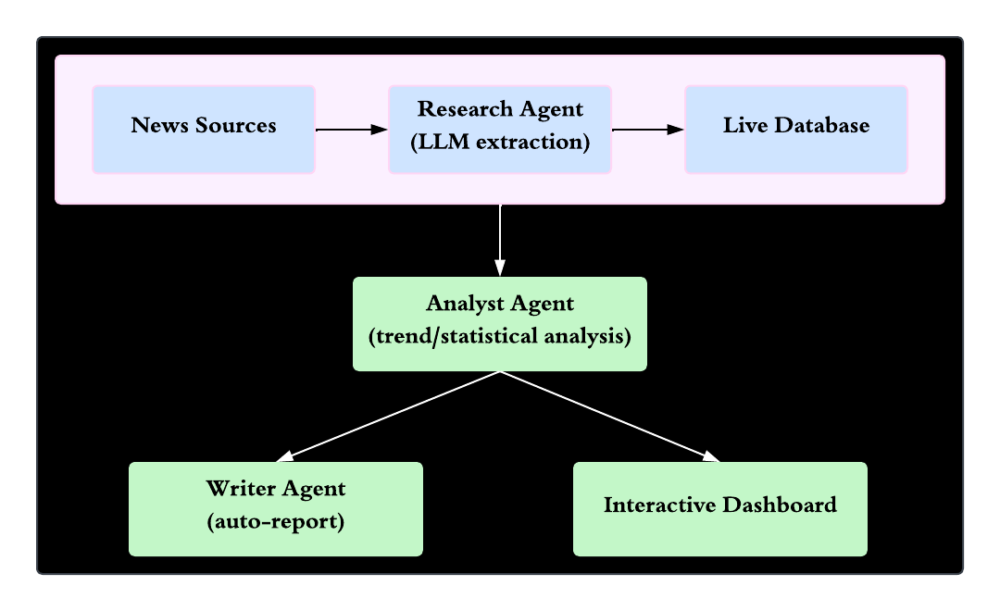

# 📋 PaperTrail

**Autonomous tracking and analysis of exam paper leak incidents in India (2004-2026)**

🔗 [Live Dashboard](https://papertrail-shreya-dalvi.streamlit.app/)

---

## Overview

PaperTrail is a self-updating data intelligence system that monitors, analyzes, and reports on exam paper leak incidents across India. Built on a historical dataset of 110+ documented incidents, it uses a multi-agent architecture to autonomously detect new incidents from live news, run statistical analysis, and generate readable policy reports, all without manual intervention.

Unlike a static analysis project, PaperTrail's underlying dataset grows on its own. A scheduled research agent scans news daily, verifies and extracts new incidents using an LLM, and appends them to a live database. This means the dashboard reflects more than what existed when the project was first built, and keeps growing every day.

## What It Does

- **Tracks** exam paper leak incidents across India from 2004 to the present, spanning central and state level exams
- **Monitors** live news daily via an autonomous research agent, using an LLM to extract structured incident data from unstructured articles
- **Analyzes** trends across eight dimensions: yearly frequency, state wise hotspots, leak mechanisms, conducting bodies, scale of impact, political era comparison, and the measured impact of the 2024 Public Examinations Act
- **Forecasts** short term incident trends using time series modeling
- **Generates** a readable policy brief report automatically from the latest analysis
- **Visualizes** everything in a live, filterable dashboard

## Architecture

News is picked up daily by the Research Agent, which uses an LLM to extract structured incident data and add it to the live database. The Analyst Agent then runs statistical analysis on the current state of the data, feeding both the Writer Agent (which drafts a plain language report) and the interactive dashboard. Every layer always works off the latest data, so nothing here is a one time snapshot.

## Key Findings

- Incidents have risen sharply since 2021, following a sparse and sporadic pattern in earlier years
- Madhya Pradesh, Uttar Pradesh, and Rajasthan account for the largest share of state level incidents
- Insider leaks and impersonation or solver networks are the most commonly identified leak mechanisms
- The 2024 Public Examinations Act coincides with a measurable shift in reported outcomes, though the post Act sample remains small. This is presented as an early signal, not a conclusive causal result

## Tech Stack

**Data and Analysis:** Python, pandas, statsmodels  
**Database:** PostgreSQL (Supabase)  
**AI and LLM:** Groq (Llama 3.3)  
**Automation:** GitHub Actions (scheduled daily agent runs)  
**Dashboard:** Streamlit  
**Dataset:** [India Paper Leaks 2004-2026 (Kaggle)](https://www.kaggle.com/datasets/sujaynadkarni/india-paper-leaks-from-2004-to-2026)

## Live Demo

The dashboard is publicly accessible and updates daily as the research agent detects new incidents.

🔗 **[View Live Dashboard](https://papertrail-shreya-dalvi.streamlit.app/)**

---

*All incident data is drawn from publicly reported news sources. Findings involving policy comparisons are presented with appropriate statistical caveats and are not intended as definitive causal claims.*
